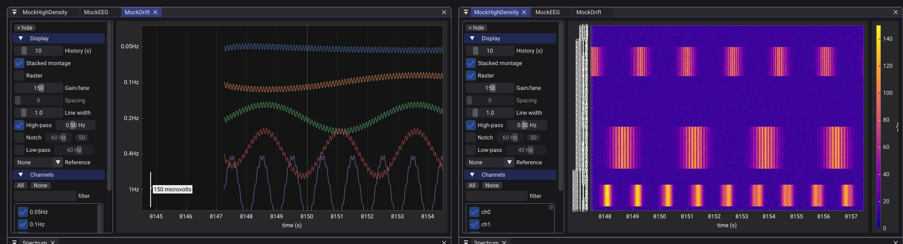
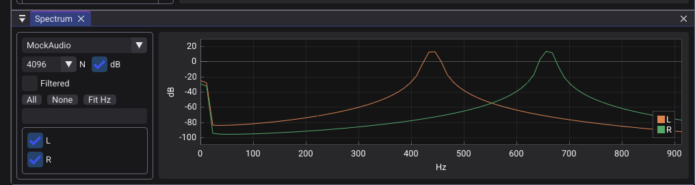
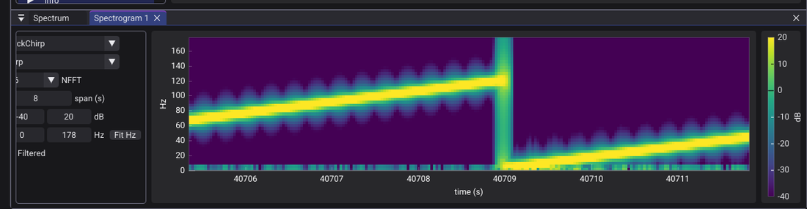
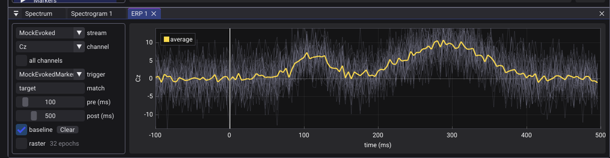

# lsl_viewer

A real-time viewer for [Lab Streaming Layer](https://github.com/sccn/labstreaminglayer) (LSL) streams. It plots live data (EEG, MEG, fNIRS, accelerometers, markers, …), applies display filters, computes spectra and marker-averaged responses, and records to XDF, in a single GPU-rendered window.


---

## Features

### Live multi-stream time series



- Stacked montage (one named lane per channel) or shared-axis overlay, with per-channel gain and an auto-fit.
- A raster/heatmap mode for high channel counts (32–256+), where individual line traces become too thin to read.
- Pause to inspect a frozen window.
- Dropouts are drawn as gaps on the real timeline rather than concatenating across the missing span.

### Signal conditioning

Independent filter stages applied in any combination; the spectrum, spectrogram, and
zoomed views use the conditioned signal.

- High-pass (DC/drift removal), mains notch (50 / 60 Hz), low-pass.
- Re-referencing: common-average (CAR) or a single reference channel. CAR averages over the EEG channels only; EOG/EMG/trigger channels are excluded based on the channel metadata.

### Frequency-domain analysis

| Per-channel FFT spectrum | Rolling spectrogram |
|---|---|
|  |  |

- Per-channel PSD (dB or linear) for the selected channels.
- A rolling STFT spectrogram with an adjustable frequency range. "Fit Hz" sets the range to the band that carries signal energy, which helps when the sample rate is high relative to the signal of interest (e.g. audio, where the tones sit well below the Nyquist frequency).
- Both can read the raw or the conditioned signal.

### ERP / marker-aligned averaging



- Epoch around events from a marker stream (with optional label matching, e.g. `target`) and average over trials, with the single-trial traces drawn under the average.
- Single- or multi-channel, plus an erpimage (trials x time, or channels x time) view.

### Recording

- XDF recording of every connected stream, LabRecorder-compatible (checked against LabRecorder via `pyxdf`). Raw timestamps and clock-offset chunks are stored so importers can realign streams to a common clock.
- Filename templating (`sub-{subject}_task-{task}_run-{run}_eeg.xdf`).
- A headless `xdf_record` CLI (no GUI).

### Other

- Docking layout: a Streams rail on the left; plots and analysis windows are tabs you arrange.
- Saved workspaces: store the current view (per-stream filters/channels/gains, the open analysis windows, the dock layout) and reload it later. On load it reconnects the streams the workspace referenced (matched by `source_id`) and lists any that aren't on the network; recording is held until they connect or the notice is dismissed.
- Per-stream info: type, source id, channels, sensor positions, and live measured-rate / clock-offset / dropout counters.
- TCP remote control for recording (see below).
- Light / dark theme; layout persisted between sessions.

## Remote control

With a control port enabled (`LSL_RC_PORT=22345`, or from the Recording panel), a client drives recording over TCP with newline-terminated commands; replies are human-readable lines. The commands:

| command | effect |
|---|---|
| `streams` | list resolvable streams, one per line: `key \| name \| type \| Nch \| rate` |
| `selected` | the keys currently connected (= what gets recorded) |
| `select all\|none\|<k1,k2,…>` | choose which streams to connect/record (`key` = `source_id`) |
| `set <subject\|session\|task\|run\|acq\|modality> <value>` | fill a filename-template field |
| `filename <path>` | set the output path/template directly |
| `start [path]` · `stop` | begin / end recording |
| `get [path]` | stream a finished recording back to the client: a header line `OK <bytes> <name>` then `<bytes>` of raw XDF |
| `status` | recording? + file / seconds / MB / streams |
| `help` · `quit` | list commands / close the connection |

So a script can query what's on the network, pick the streams it wants, fill the BIDS
fields, and record-- all from the same process that runs the experiment:

```python
import socket

def cmd(sock, line):
    sock.sendall((line + "\n").encode())
    return sock.recv(8192).decode().strip()

with socket.create_connection(("localhost", 22345)) as rc:
    print(cmd(rc, "streams"))
    #   mock-eeg            | MockEEG           | EEG     | 32ch | 500
    #   mock-evoked-markers | MockEvokedMarkers | Markers |  1ch | 0
    #   mock-audio          | MockAudio         | Audio   |  2ch | 48000

    # record only the EEG + its markers (keys are the source_ids from `streams`)
    cmd(rc, "select mock-eeg,mock-evoked-markers")
    print(cmd(rc, "selected"))                 # -> mock-eeg mock-evoked-markers

    for field, val in dict(subject="01", session="01", task="oddball", run="1").items():
        cmd(rc, f"set {field} {val}")          # -> sub-01/ses-01/eeg/sub-01_…_eeg.xdf

    cmd(rc, "start")
    # ... present stimuli, push markers via LSL ...
    cmd(rc, "stop")
    print(cmd(rc, "status"))
```

After `stop`, `get` streams the finished `.xdf` back over the same connection. This can be useful when the viewer runs on the acquisition machine and your analysis runs elsewhere:

```python
def fetch(rc, dest):
    rc.sendall(b"get\n")
    buf = b""
    while b"\n" not in buf:                      # read the "OK <bytes> <name>" header line
        buf += rc.recv(4096)
    head, _, body = buf.partition(b"\n")
    tag, size, _name = head.split(maxsplit=2)
    if tag != b"OK":
        raise RuntimeError(head.decode())
    size = int(size)
    while len(body) < size:                      # then read exactly <bytes> of raw XDF
        body += rc.recv(1 << 16)
    open(dest, "wb").write(body[:size])
```

The control endpoint is also advertised over LSL (type `ViewerControl`); resolve it to get the host and the port (encoded in `source_id` as `lsl-viewer-rc:<port>`) instead of hard-coding `22345`. `nc localhost 22345` works for poking at it by hand.

## Quick start

Dependencies are fetched by CMake; you need a C++20 compiler and CMake ≥ 3.23 (on Linux, also SDL3's display-backend headers; see [docs/building.md](docs/building.md)).

```bash
cmake -S . -B build -G Ninja -DCMAKE_BUILD_TYPE=Release
cmake --build build
./build/lsl_viewer          # on WSL: ./run.sh

# in another terminal, generate some synthetic streams to view:
uv run tools/lsl_test_streams.py --streams eeg,sine,chirp,markers,evoked
```

Connect streams from the Streams rail (or set `LSL_AUTOCONNECT=1`).

## Roadmap

- Scalp topography (topomap): interpolated head map of amplitude / band power. Per-channel sensor positions are already parsed from stream metadata (so it is modality-agnostic: EEG/MEG/fNIRS), and the Info panel reports how many channels carry a layout.
- Bipolar montages: named electrode chains (e.g. the longitudinal "double banana").
- Markers drag-onto-plot and richer marker/event handling.
- Per-channel bad-channel rejection (manual exclude from CAR / display).

## Documentation

- [docs/building.md](docs/building.md): building, CMake flags, static / single-file builds, Windows, repo layout.
- [DESIGN.md](DESIGN.md): architecture and rationale (ring buffers, threading, the rendering path).

## License

MIT -- see [LICENSE](LICENSE). The viewer bundles third-party components (SDL3, Dear ImGui, ImPlot, liblsl, KissFFT, spdlog, the Roboto font) and adapts LabRecorder's `xdfwriter`. Their copyright notices and licenses are in [THIRD_PARTY_LICENSES](THIRD_PARTY_LICENSES).

Built with [SDL3](https://github.com/libsdl-org/SDL) + SDL_GPU, [Dear ImGui](https://github.com/ocornut/imgui) (docking) + [ImPlot](https://github.com/epezent/implot), [liblsl](https://github.com/sccn/liblsl), and [KissFFT](https://github.com/mborgerding/kissfft). C++20.
