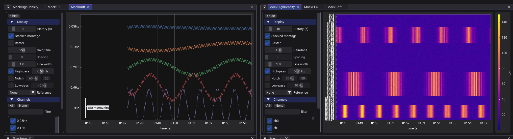
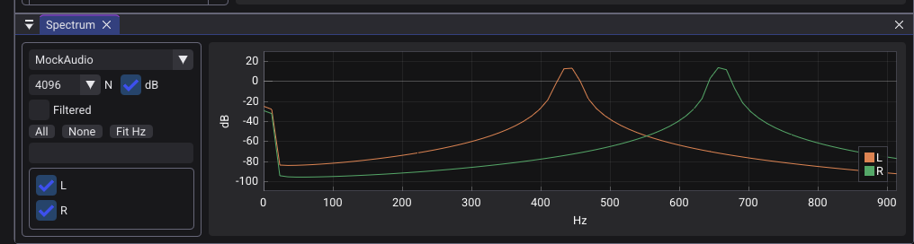
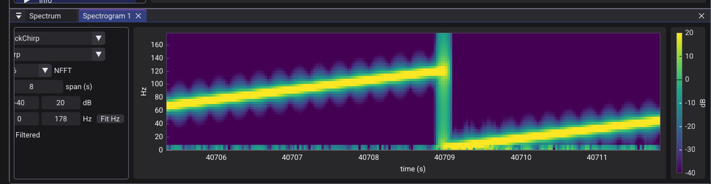
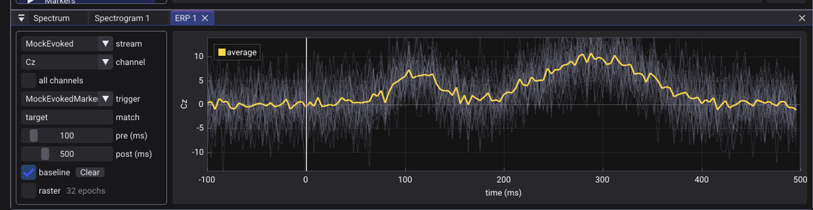

# lsl_viewer

A real-time viewer for [Lab Streaming Layer](https://github.com/sccn/labstreaminglayer) (LSL) streams. It plots live data (EEG, MEG, fNIRS, accelerometers, markers), applies display filters, computes spectra and marker-averaged responses, and records to XDF.


## Quick start

To try all the views without an external source, launch the application and select **Tools > Emit demo streams**. The viewer then publishes a synthetic set: EEG with EOG, a 1 Hz to 40 Hz chirp, a 48 kHz stereo tone, and an evoked-response stream with markers.

## Features

### Live multi-stream time series



- A stacked montage that gives each channel its own named lane, or a shared-axis overlay. Each channel has a gain control, and there is an auto-fit.
- A raster/heatmap mode for high channel counts (32 to 256 or more), where single line traces become too thin to read.
- A pause control, to examine a frozen window.
- Dropouts show as gaps on the real timeline. The viewer does not join the data across the missing span.
- **Lock time axes** (Tools menu) applies one time window to all stream plots. The plots stay aligned, and they pan and zoom together. If a plot becomes difficult to read, **Reset view** in its panel puts it back to the default framing.
- Marker and event streams show as labeled event lines on the time series. The **Marker events** log (View menu) also lists them as a scrolling `time  value` feed. Thus you can see the events when no continuous stream is running.

### Signal conditioning

You can apply the filter stages in any combination. The spectrum, spectrogram, and zoomed views use the conditioned signal.

- High-pass (removes DC and drift), mains notch (50 Hz or 60 Hz), and low-pass.
- Re-referencing to the common average (CAR) or to one reference channel. CAR averages the EEG channels only. It excludes EOG, EMG, and trigger channels, which it identifies from the channel metadata.

### Frequency-domain analysis

| Per-channel FFT spectrum | Rolling spectrogram |
|---|---|
|  |  |

- A PSD (in dB or linear units) for each selected channel.
- A rolling STFT spectrogram with an adjustable frequency range. **Fit Hz** sets the range to the band that holds the signal energy. This helps when the sample rate is high compared to the signal of interest. Audio is an example, because the tones are much lower than the Nyquist frequency.
- Both views can read the raw signal or the conditioned signal.

### ERP and marker-aligned averaging



- Epochs around the events from a marker stream, averaged across trials. The viewer draws the single-trial traces below the average.
- Optional exact label matching. Give one label, such as `target`, or more than one label with a spaced pipe (` | `) between them, such as `start_a | start_b`.
- One channel or many channels, and an erpimage view (trials by time, or channels by time).

### Recording

- XDF recording of all connected streams. The files are compatible with LabRecorder, which was checked against LabRecorder output with `pyxdf`. The viewer keeps the raw timestamps and the clock-offset chunks, thus an importer can align the streams to a common clock.
- Filename templates, such as `sub-{subject}_task-{task}_run-{run}_eeg.xdf`.
- A headless CLI, `xdf_record`, that records without the GUI.

### Other

- A docking layout. The Streams rail is on the left. The plots and the analysis windows are tabs that you arrange.
- Saved workspaces. A workspace holds the current view: the filters, channels, and gains for each stream, the open analysis windows, and the dock layout. When you load a workspace, the viewer reconnects the streams that the workspace refers to (matched on source ID and name) and lists the streams that are not on the network. It holds the recording until those streams connect or you dismiss the notice.
- Information for each stream: type, source ID, channels, sensor positions, and live counters for the measured rate, the clock offset, and the dropouts.
- TCP remote control of the recording. See [Remote control](#remote-control).
- A light theme and a dark theme. The viewer keeps the layout between sessions.

## Remote control

Enable a control port from the Recording panel, or with `LSL_RC_PORT=22345`. A client then controls the recording over TCP. The commands end with a newline, and the replies are lines of readable text.

The port binds to loopback (127.0.0.1) only. There is no authentication. To use the port from a different machine, turn on **Allow LAN access** in the Recording panel, or set `LSL_RC_BIND=all`. Use trusted networks only. Up to four clients can connect at the same time.

| Command | Effect |
|---|---|
| `streams` | Lists the streams that LSL can resolve, one per line: `key \| name \| type \| Nch \| rate`. The first field is the key. If there are no streams, the reply is `(none)`. |
| `selected` | Shows the keys that are connected. These streams are the ones that get recorded. |
| `select all\|none\|<k1,k2,...>` | Selects the streams to connect and record. Each `key` is an identifier from `streams`. If a key is not a stream that the viewer can see, the viewer refuses the whole command. The command is also refused during a recording, because the set is locked until `stop`. |
| `set <subject\|session\|task\|run\|acq\|modality> <value>` | Fills one field of the filename template. |
| `filename <path>` | Sets the output path or template directly. |
| `start [path]` and `stop` | Start and stop the recording. |
| `get` | Sends the last completed recording to the client: a header line `OK <bytes> <name>`, then `<bytes>` of raw XDF. |
| `status` | Shows the recording state, the file, the seconds, the megabytes, and the streams. |
| `help` and `quit` | List the commands, and close the connection. |

Each reply is one line, and it starts with `ok:` or `error:`. The exceptions are `streams`, which gives one line for each stream, and `get`, which gives a header line and then raw data.

The `select`, `start`, and `stop` commands must go through the viewer. They do not reply until the viewer has done the work, thus the reply gives the result: `ok: recording -> /path/file.xdf`, or `error: no streams connected`. A `status` that comes after such a reply always shows the new state. If the viewer does not answer in 2 seconds, the reply is `error: the viewer did not respond`, and the command is discarded.

Thus a script can find the streams on the network, select the streams it wants, fill the BIDS fields, and record. The same process that runs the experiment can do all of this:

```python
import socket

def cmd(sock, line):
    sock.sendall((line + "\n").encode())
    return sock.recv(8192).decode().strip()

with socket.create_connection(("localhost", 22345)) as rc:
    print(cmd(rc, "streams"))
    #   mock-eeg            | MockEEG           | EEG     | 32ch | 500
    #   mock-evoked-markers | MockEvokedMarkers | Markers |  1ch | 0
    #   mock-audio          | MockAudio         | Audio   |  2ch | 48000

    # Record the EEG and its markers only. The keys come from the `streams` list.
    # A key that the viewer cannot see makes this fail, thus a typo cannot
    # silently give you a recording with fewer streams than you asked for.
    print(cmd(rc, "select mock-eeg,mock-evoked-markers"))   # -> ok: connected 2 stream(s)
    print(cmd(rc, "selected"))                 # -> mock-eeg mock-evoked-markers

    settings = {"subject": "01",
                "session": "01",
                "task": "posner",
                "run": "1"}

    for field, val in settings.items():
        cmd(rc, f"set {field} {val}")          # -> sub-01/ses-01/eeg/sub-01_..._eeg.xdf

    # `start` returns when the file is open, thus this catches a bad path or an
    # empty selection before the experiment runs.
    reply = cmd(rc, "start")
    if reply.startswith("error"):
        raise RuntimeError(reply)
    # Present the stimuli, and push the markers through LSL.
    cmd(rc, "stop")
    print(cmd(rc, "status"))
```

After `stop`, the `get` command sends the completed `.xdf` file back on the same connection. This is useful when the viewer runs on the acquisition machine and the analysis runs on a different machine. The command waits up to 3 seconds for the viewer to flush the file, thus a script can call `get` directly after `stop`.

```python
def fetch(rc, dest):
    rc.sendall(b"get\n")
    buf = b""
    while b"\n" not in buf:                      # Read the "OK <bytes> <name>" header line.
        buf += rc.recv(4096)
    head, _, body = buf.partition(b"\n")
    tag, size, _name = head.split(maxsplit=2)
    if tag != b"OK":
        raise RuntimeError(head.decode())
    size = int(size)
    while len(body) < size:                      # Then read exactly <bytes> of raw XDF.
        body += rc.recv(1 << 16)
    open(dest, "wb").write(body[:size])
```

### Discovery

The viewer also announces the control endpoint through LSL, with the type `ViewerControl`. Resolve it to get the host and the port instead of writing `22345` in your code. The `source_id` has the form `lsl-viewer-rc:<host>:<pid>:<port>`, thus the port is the text after the last colon. The host and the process ID make the identifier different for each viewer, because LSL uses `source_id` as the identity of a stream.

```python
from pylsl import resolve_byprop, StreamInlet

for info in resolve_byprop("type", "ViewerControl", timeout=5.0):
    port = int(info.source_id().rsplit(":", 1)[1])
    desc = StreamInlet(info).info(timeout=3).desc()      # port, pid, bind, protocol
    host = "127.0.0.1" if desc.child_value("bind") == "loopback" else info.hostname()
```

Two things to know when you write a client:

- **The port can move.** If port 22345 is in use, and you did not set `LSL_RC_PORT`, the viewer takes a port from the operating system and announces that one. Thus a second viewer on the same machine also has a control port. If you do set `LSL_RC_PORT`, the viewer uses that port or none, because a script that asks for a port must not get a different one.
- **The host from `resolve` is not always the address to connect to.** A viewer that binds to loopback only is reachable at `127.0.0.1`, and only from the same machine, but LSL still reports the machine name. The `bind` field in the description says which: `loopback` or `all`.

To examine the endpoint by hand, use `nc localhost 22345`.

## System requirements

The viewer renders through **SDL_GPU**, the GPU abstraction of SDL3. Thus it needs a GPU and a driver that support one of the SDL_GPU backends, and a desktop display server. The other requirements are small: a few hundred MB of RAM, and any recent multi-core CPU.

- **Windows:** Windows 10 or later (64-bit), with a GPU and driver that support **Direct3D 12**. If Vulkan is available, SDL_GPU uses Vulkan instead.
- **macOS:** macOS 11 (Big Sur) or later, on a Mac with **Metal** support. This includes Apple Silicon Macs and Intel Macs with a Metal GPU. The `.app` and `.dmg` files are unsigned. For the first launch, right-click the app and select **Open**. On macOS 15 (Sequoia) and later, permit the local network when the system asks. If you refuse, the viewer finds no streams. See [docs/network.md](docs/network.md).
- **Linux:** a **Vulkan** loader and driver (`libvulkan` and an ICD for your GPU), and **Wayland or X11**. The AppImage is the easiest way to run the viewer on different distributions.

**Network:** LSL finds and reads the streams on the local network. It uses UDP broadcast and multicast to resolve the streams, and TCP to transfer the data. Thus the sources must be on the same subnet, and you can be required to permit the viewer through the firewall. The Windows installer adds the firewall rules for you. See [docs/network.md](docs/network.md) for the ports, for the portable build, and for what to do when the viewer finds no streams.

**Headless recorder:** `xdf_record` has no GPU or display requirements. It links only to liblsl, and the static musl build for Linux runs on all Linux distributions.

## Documentation

- [docs/building.md](docs/building.md): how to build, the CMake flags, the static and single-file builds, Windows, and the repository layout.
- [docs/network.md](docs/network.md): the LSL ports, the firewall rules for each platform, the macOS local network permission, and what to do when the viewer finds no streams.
- [DESIGN.md](DESIGN.md): the architecture and the reasons for it (the ring buffers, the threading, and the rendering path).

## Roadmap

- Scalp topography (topomap): an interpolated head map of the amplitude or the band power. The viewer already reads the sensor positions for each channel from the stream metadata, thus the map can apply to EEG, MEG, or fNIRS. The Info panel shows how many channels have a layout.
- Bipolar montages: named electrode chains, such as the longitudinal "double banana".
- Drag-and-drop of markers onto a plot, and more marker and event controls.
- Manual rejection of bad channels, which excludes them from the CAR and from the display.

## License

MIT. See [LICENSE](LICENSE). The viewer includes third-party components (SDL3, Dear ImGui, ImPlot, liblsl, KissFFT, spdlog, and the Roboto font), and it adapts the `xdfwriter` of LabRecorder. Their copyright notices and licenses are in [THIRD_PARTY_LICENSES](THIRD_PARTY_LICENSES).

## Acknowledgments

Built with [SDL3](https://github.com/libsdl-org/SDL) and SDL_GPU, [Dear ImGui](https://github.com/ocornut/imgui) (docking) with [ImPlot](https://github.com/epezent/implot), [liblsl](https://github.com/sccn/liblsl), and [KissFFT](https://github.com/mborgerding/kissfft). C++20.

Thanks to the developers of LSL, SDL, Dear ImGui, ImPlot, spdlog, KISS FFT, and Tracy for these useful and foundational tools.

I used AI (Claude Opus 4.8 and later models) to help me develop this tool.
